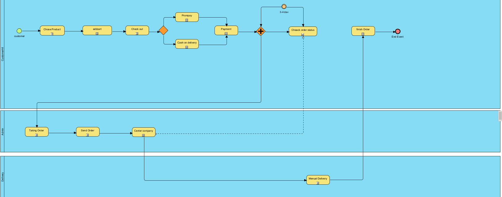
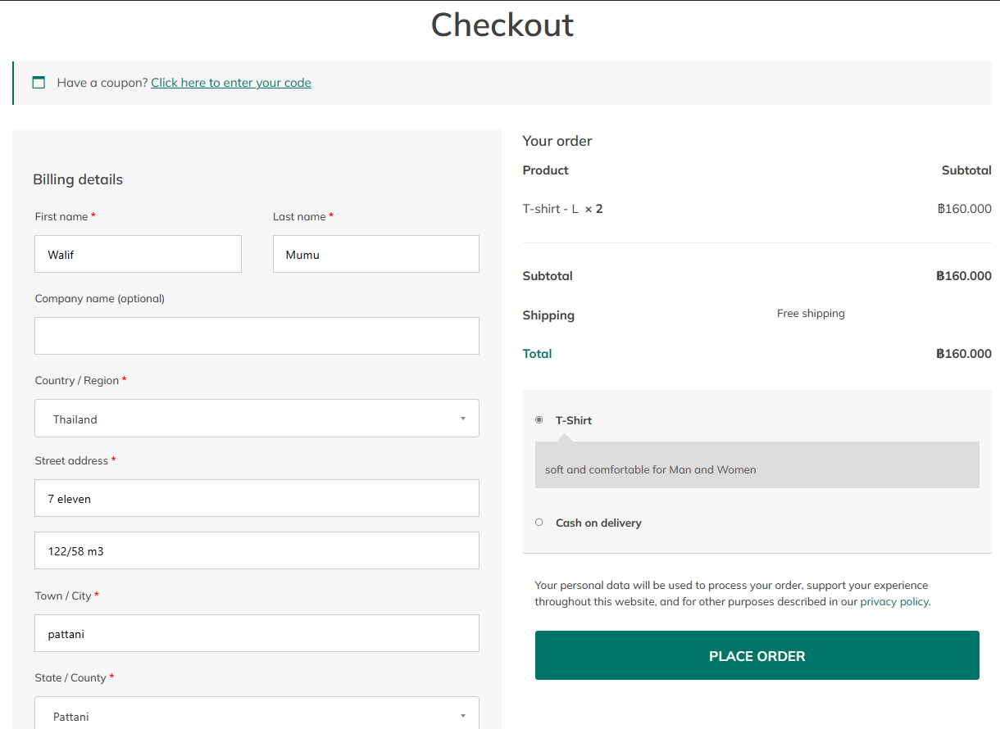

## Modern-Ecommerce-Platforms
# Design and Develop Modern Ecommerce Plafform

# Introduction
 This project is about developing an e-commerce website for , a t-shirt shop. The website will be built using the WordPress content management system and will include the WooCommerce plugin to facilitate a seamless e-commerce experience. This platform will allow customers to browse, choose and order online comfortable

# Software and Tools Used
- Laragon: Laragon is utilized as our local development environment, providing a convenient platform for building and testing the t-shirt shop E-Commerce Website before deployment.

- WordPress: WordPress serves as the primary content management system (CMS) for our website, offering a flexible and user-friendly environment for managing web content.

- WooCommerce: WooCommerce is integrated seamlessly with WordPress, empowering our website with e-commerce capabilities, including product management, shopping cart functionality, and secure payment processing.

- PDF Invoices & Packing Slips for WooCommerce: PDF Invoices & Packing Slips for WooCommerce is responsible for generating professional invoices and packing slips for customer orders, ensuring a smooth and professional shopping experience.

- Akismet Anti-Spam: Spam Protection   Used by millions, Akismet is quite possibly the best way in the world to protect your blog from spam. Akismet anti spam keeps your site protected even while you sleep. To get started: activate the Akismet plugin and then go to your Akismet Settings page to set up your API key.

## Project Overviw
- Plugin
- WooCommerce
- PDF Invoices & Packing Slips for WooCommerce
-  Akismet Anti-Spam: Spam Protection

## Theames
- YITH Wonder
  
# HomePage

## All Pools in BPMN
- Customer
- Admin
- Website
- Delivery

## BPMN Diagram

  - Add to Cart: The selected products are added to the customer's shopping cart.

- Check Out Process: The process to Checkout the product.
   - Fill the shipping detail: The customer fill their shipping detail.

 - Identify payment method: Payment information, such as Prompay details, is entered.

# Oder

# Conclution
