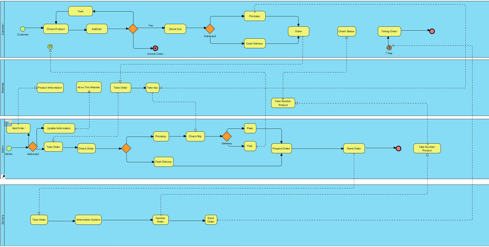
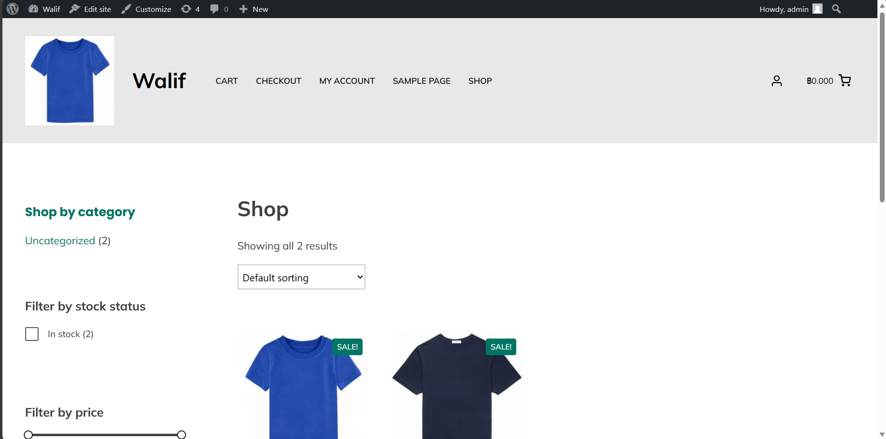
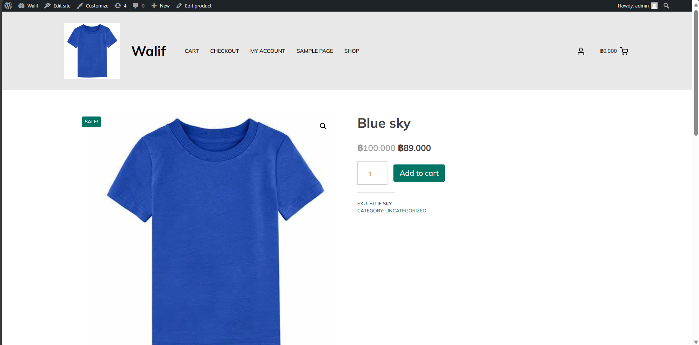
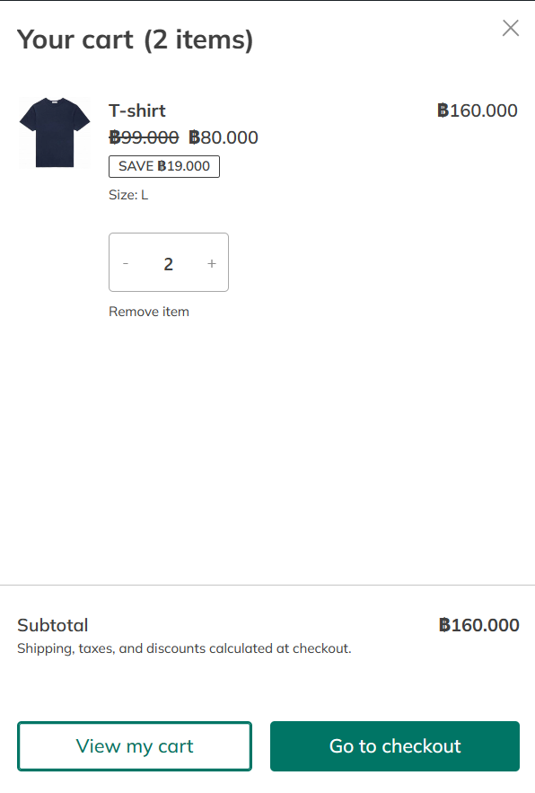
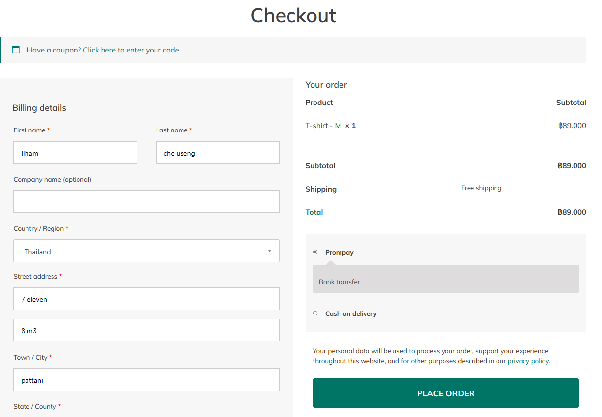
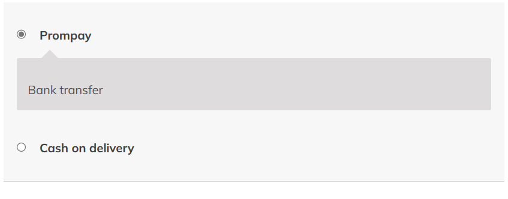
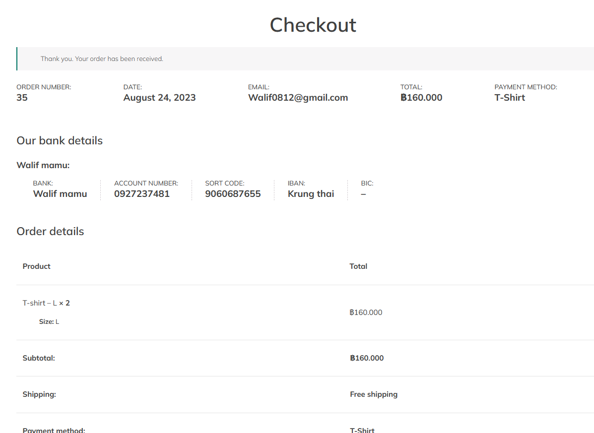
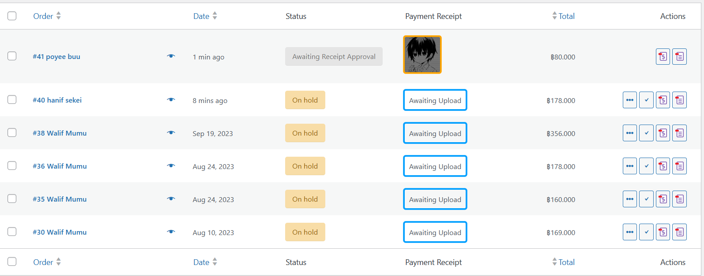

## Modern-Ecommerce-Platforms
# Design and Develop Modern Ecommerce Plafform
 This project involves creating a simple modern e-commerce platform using Wordpress forms and includes modeling of business process systems from customer until delivery.
 
# Introduction
 This project is about developing an e-commerce website for , a t-shirt shop. The website will be built using the WordPress content management system and will include the WooCommerce plugin to facilitate a seamless e-commerce experience. This platform will allow customers to browse, choose and order online comfortable

## The main plugins that I use 
- WooCommerce
- PDF Invoices & Packing Slips for WooCommerce
- PeproDev WooCommerce Receipt Uploader 

## Theames
- YITH Wonder

# Software and Tools Used
- ***Laragon***: is utilized as our local development environment, providing a convenient platform for building and testing the t-shirt shop E-Commerce Website before deployment.

- **WordPress**: WordPress serves as the primary content management system (CMS) for our website, offering a flexible and user-friendly environment for managing web content.

- **WooCommerce**: is integrated seamlessly with WordPress, empowering our website with e-commerce capabilities, including product management, shopping cart functionality, and secure payment processing.

- **PDF Invoices & Packing Slips for WooCommerce**: is responsible for generating professional invoices and packing slips for customer orders, ensuring a smooth and professional shopping experience.

- **PeproDev WooCommerce Receipt Uploader**: is For   Upload Receipt for Any Payment method in WooCommerce. Customers will Upload the receipt (image/pdf) and Shop Managers will approve/reject it manually
Upload Receipt for Any Payment method in WooCommerce. Customers will Upload the receipt (image/pdf) and Shop Managers will approve/reject it manually

## All in BPMN
- Customer
- Admin
- Website
- Delivery

## BPMN Diagram

  
# HomePage

  - Add to Cart: The selected products are added to the customer's shopping cart.

- Check Out Process: The process to Checkout the product.
   - Fill the shipping detail: The customer fill their shipping detail.

 - Identify payment method: Payment information, such as Prompay details, is entered.

# Uplord order

# Oder

# Conclution
E-Commerce Website is a testament to the power of digital of online shop  for easy ordering
