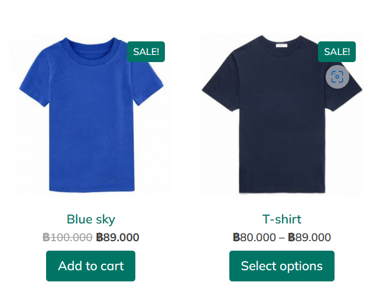

## Modern-Ecommerce-Platforms
# Design and Develop Modern Ecommerce Plafform
 
 This project is about developing an e-commerce website for Walif Shop, a t-shirt shop. The website will be built using the WordPress content management system (CMS) and will include the WooCommerce plugin to facilitate a seamless e-commerce experience. This platform will allow Walif Shop customers to browse, choose and order online. and comfortable

# Software and Tools Used
- Laragon: Laragon is utilized as our local development environment, providing a convenient platform for building and testing the t-shirt shop E-Commerce Website before deployment.

- WordPress: WordPress serves as the primary content management system (CMS) for our website, offering a flexible and user-friendly environment for managing web content.

- WooCommerce: WooCommerce is integrated seamlessly with WordPress, empowering our website with e-commerce capabilities, including product management, shopping cart functionality, and secure payment processing.

- PDF Invoices & Packing Slips for WooCommerce: PDF Invoices & Packing Slips for WooCommerce is responsible for generating professional invoices and packing slips for customer orders, ensuring a smooth and professional shopping experience.

-  Opn Payments: Opn Payments has been integrated to expand our payment gateway options, providing customers with even more flexibility in how they pay for their purchases.
 

## Project Overviw
- Plugin
- WooCommerce
- Elementor
- PDF Invoices & Packing Slips for WooCommerce
- Opn Payments

## Theames
- YITH Wonder

## All Pools in BPMN
- Customer
- Admin
- Website
- Delivery

## BPMN Diagram

  - Add to Cart: The selected products are added to the customer's shopping cart.

- Check Out Process: The process to Checkout the product.
   - Fill the shipping detail: The customer fill their shipping detail.

 - Identify payment method: Payment information, such as Prompay details, is entered.

