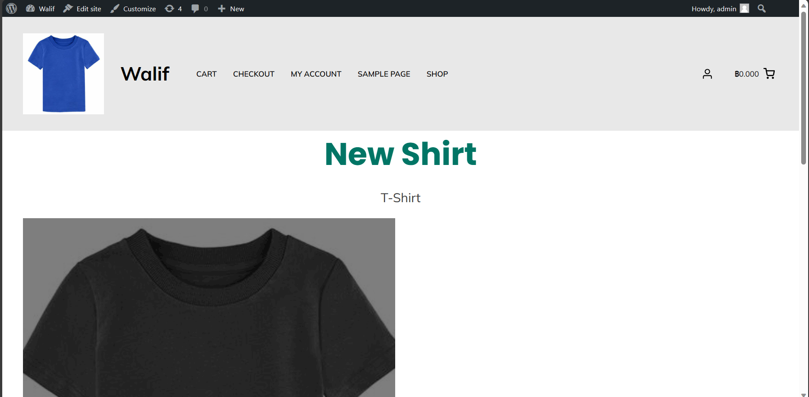

## Modern-Ecommerce-Platforms
# Design and Develop Modern Ecommerce Plafform
 
 This project is about developing an e-commerce website for Walif Shop, a t-shirt shop. The website will be built using the WordPress content management system (CMS) and will include the WooCommerce plugin to facilitate a seamless e-commerce experience. This platform will allow Walif Shop customers to browse, choose and order online. and comfortable
 

## Project Overviw
- Plugin
- WooCommerce
- Elementor
- PDF Invoices & Packing Slips for WooCommerce
- Opn Payments

## BPMN Diagram

## All Pools in BPMN
- Customer
- Website

